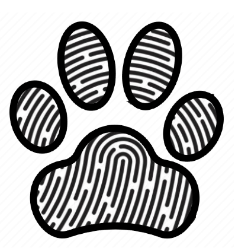
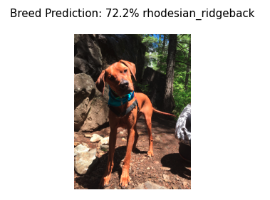
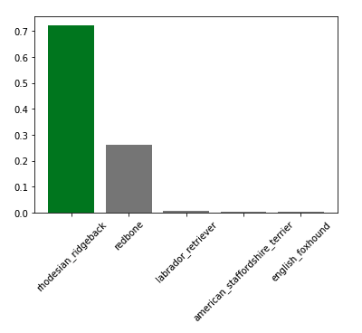
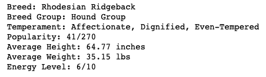

# Paw Print



# Project Overview
This project aims to create a model that can accurately predict a dog's breed given an image. Additionally it will output the top 5 breed predictions and the breed traits (including temperament, size, energy level, trainability, etc) of the predicted breed.

Using Tensorflow's Pre-Trained Convolutional Neural Networks we were able to produce a model that had a prediction accuracy of 78%. With further analysis we have determined that, 94% of the time, our model will classify an image as the correct breed within the top 5 predictions.


# Business Understanding
Every year over 3 million dogs end up in animal shelters. A study done in 2013 showed that shelter staff correctly visually identify breeds accurately 67% of the time, and that accuracy was exponentially lower for dogs that are mixed breeds. Additionally the number one question asked by people looking for dogs in a shelter is "what breed is that dog?". Creating a model that can predict a dogs breed given an image can be extremely useful for accurately classifying animals at animal shelters. Additionally,  an accurate breed prediction and corresponding breed traits has the potential to lead to a higher rate of dog adoptions within shelters, which could save thousands of dogs lives every year. 

Creating a CNN model that can predict a dogs breed can be immensely useful for animal shelters to save time and resources, increase identification accuracy, and potentially lead to an increase in dog adoptions.


# Data Understanding
AKC Dog Breed Traits: This dataset contains dog breed traits (temperament, height, weight, trainability, energy level, etc) for over 270 dog breeds. This dataset comes from https://github.com/tmfilho/akcdata and has been pre-processed in the dog_breed_preprocessing.ipynb (add link once published) notebook so that the dog breed labels are compatible with those from our images.

Dog Breed Images and Labels: This dataset contains images of over 10,000 dogs from 120 different breeds, along with a dataframe containing each image name and their corresponding breed. This dataset comes from Kaggle https://www.kaggle.com/c/dog-breed-identification.


# Modeling
We used pre-trained Convolutional Neural Networks for models:

1. Began with a baseline MobileNetV2 model which gave us an average of 60% accuracy.
2. In attemps to increase our accuracy score, we tuned our MobileNetV2 model using GlobalAveragePooling and Dropout, which increated our score to an average of 70%
3. We then used the MobileNetV2 model from Tensorflow Hub which resulted in an average of 78% accuracy
4. We also tried another pre-trained model InceptionResNetV2 which increased our score to an average of 80% accuracy - but we chose to stick with the MobileNetV2 because of it's speed. Additionally it was able to predict corrreclty but had much lower prediction percentages (MobileNetV2 would predict a Husky at 92%, and then InceptionResNetV2 would predict it correctly, but only at 23%) 


# Final Evaluation
As stated above we decided to go with a MobileNetV2 model because it performs faster and takes up less space and showed to have really high accuracy scores compared to any other models we tried. It is also better used in Mobile App's. 
<br>
Below is an example of how our model would perform given a single image as input

<br>
We then took the top 5 predictions and filled the bar in green if any of those 5 predictions were accurate

<br>
We then got breed traits from the AKC Breed dataframe



# Conclusion
We have created a model that will predict a dog's breed with an accuracy of 78%. Further analysis shows that our model was actually able to classify the correct breed within the top 5 predictions at a 94% accuracy rate. We can conclude that our final model's 78% accuracy is an improvement over the current 67% accuracy of shelter's visual identification.

To guarantee best results, we recommend the input image be good lighting, without any image noise, and presents any distinguishable features of the dog. While testing out images, these types of images had a much higher success rate for being accurately classified. Similarly this model performed much better on images of dogs that are purebred, but still maintained some accuracy for dogs that are mixed-breed.


# Next Steps
Given more time and resources I would love to collect more training data so to work towards increasing our models accuracy. While our model has performed relatively well on being able to accurately classify 120 dog breeds, for this model to be the most useful for animal shelters it will have to improve accuracy on any mixed-breed dogs, since more often dogs in shelters are mixed-breed and not purebred.

# Further Questions
See the full analysis in the [Jupyter Notebook]() or review [this presentation]()

For any additional questions, please contact Hannah Schurman at [hannah.schurman1@gmail.com](hannah.schurman1@gmail.com)


# Repository
```
├── data                         # contains original datasets and saved models
│   ├── akc_breeds               # csv file containing breed information for 277 known AKC breeds
│   ├── akc_breeds_final         # pre-processed final version of akc_breeds csv file - cleaned up for easy use with image labels
│   ├── dog-breed-identification # folder containing train images
│   │   ├──labels.csv            # csv file containing filenames and corresponding breed labels for each image
│   │   ├──train                 # folder containing over 10,000 images of dogs for training model
│   ├── test_dogs                # folder containing test images of friends dogs to test on model
│   ├── models                   # Saved tensorflow model and tensorflow.js data
├── images                       
├── README.md
├── mobile_app
│   ├── dog-identification       # folder containing necesary files for making the mobile app
├── dog_breed_classier.ipynb
└── dog_breed_classier.pdf
```
