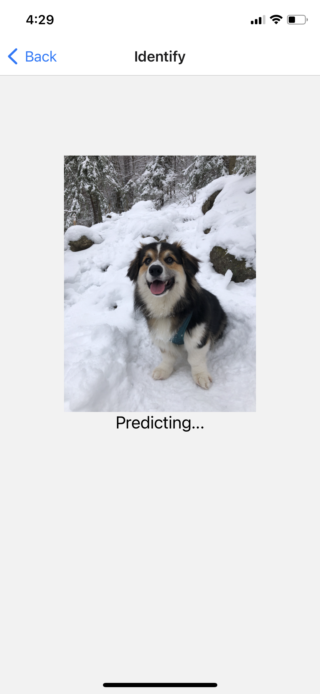
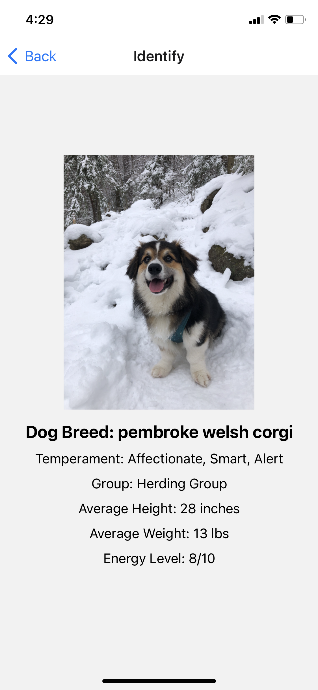

# Paw Print
This mobile app alows the user to input an image of a dog from their device, either from the library or from the camera, and uses a pre-trained Tensorflow MobileNet CNN model to identify the dogs breed. In addition to the classification, the app will also output breed traits, such as breed group, temperament, height, weight, and energy levels. 

(The intension was to use the save custom tuned MobileNet model from the jupyter notebook in this repository, but I ran into come issues with loading a pre-trained model using tensorflow.js. In the meantime, I have used the pre-trained version of MobileNet.) 


# Getting Started
This mobile application has not been deployed. Follow these steps to set the app up locally:
1. Create an account on expo and follow their installation instructions: https://docs.expo.dev/get-started/installation/
2. Clone this repository 
3. Run `expo.start`
4. Follow the instructions to open the project on your device


# App Examples
The screenshots below give examples of how the app is used:<br>





# Built with
React Native
Tensorflow.js
Expo

# Repository
```
├── App.js                     # app class that contains navigation container
├── Homescreen.js              # class that returns the home screen containers
├── Identification.js          # class that inputs image and returns prediction and corresponding traits
├── assets                     # contains splash screen, icon, and other images used in the app
└── breeds.json                # json file containing breed names and personality traits for prediction output
```